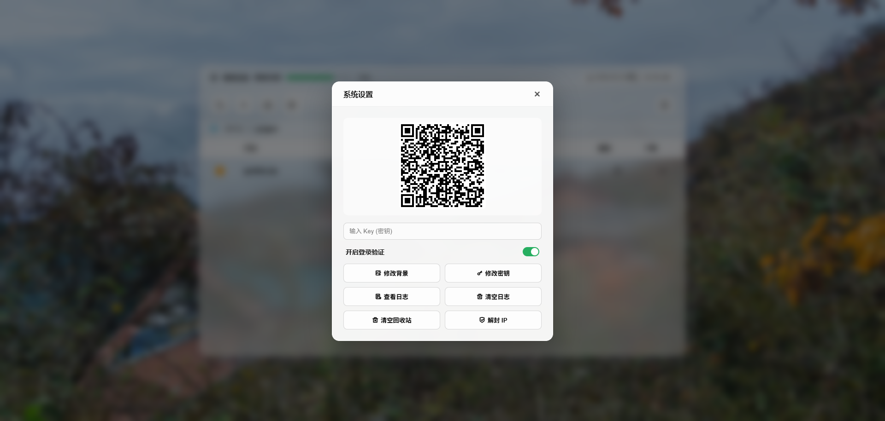
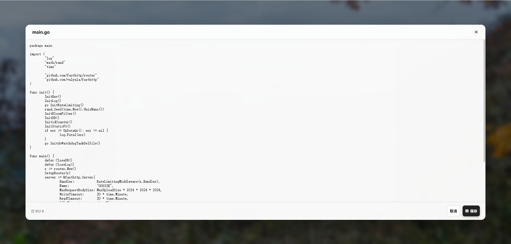

# godisk 🚀

`godisk` 是一款基于 **Go 语言** 开发的高性能、极轻量级个人私有云盘工具。它专为追求极致性能和安全性的用户设计，非常适合部署在 VPS、家用 NAS 或树莓派上。

---

## 🌟 核心特性

* **🔒 安全登录**: 深度集成 **2FA (双重身份验证)**，支持 Google Authenticator 等应用，拒绝暴力破解。
* **⚡ 高性能传输**: 原生支持**并发上传**，充分利用带宽，大文件传输更迅捷。
* **🖼️ 影音与办公**:
  * **在线预览**: 视频、音乐流媒体播放，支持进度条拖动；图片高清预览。
  * **在线编辑**: 内置代码/文本编辑器，支持在线修改并直接保存到磁盘。
* **📉 极致轻量**:
  * **待机内存占用**: 约 **18 MB**。
  * **上传峰值内存**: 稳定在 **40 - 50 MB** 左右。
* **📦 零依赖部署**: 编译后仅为一个二进制文件，不产生冗余依赖。

---

## 📸 界面预览

| 校验界面 | 设置界面 | 文本编辑 | 视频预览 | 图片预览 |
| :--- | :--- | :--- | :--- | :--- |
|  |  |  |  |  |

---

## 🚀 快速开始

### 1. 环境变量配置

在运行程序前，请根据需求配置以下环境变量：

| 变量名 | 是否必填 | 默认值 | 说明 |
| :--- | :---: | :---: | :--- |
| `GODISK_ADMIN_KEY` | **必须** | 无 | 管理员初始化及登录的唯一访问密钥 |
| `GODISK_PORT` | 可选 | `80` | 服务运行端口 |
| `GODISK_UPLOAD_SIZE` | 可选 | `50` | 最大上传限制 (单位: GB) |

### 2. 下载与编译

```bash
# 克隆仓库
git clone [https://github.com/clain333/godisk.git](https://github.com/clain333/godisk.git)
cd godisk

# 下载依赖
go mod tidy

# 编译运行文件
go build -o godisk